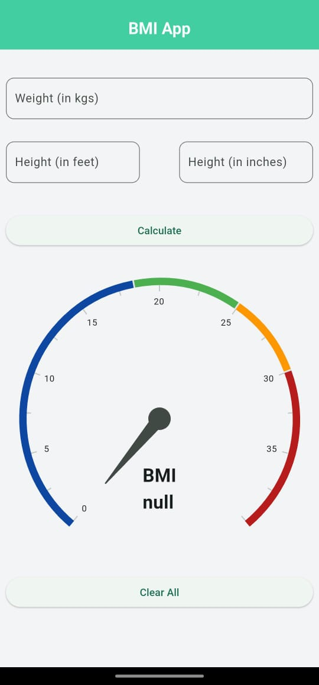
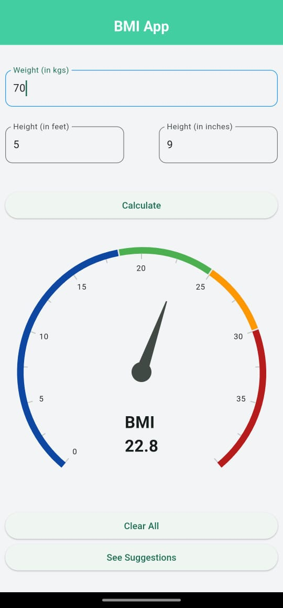
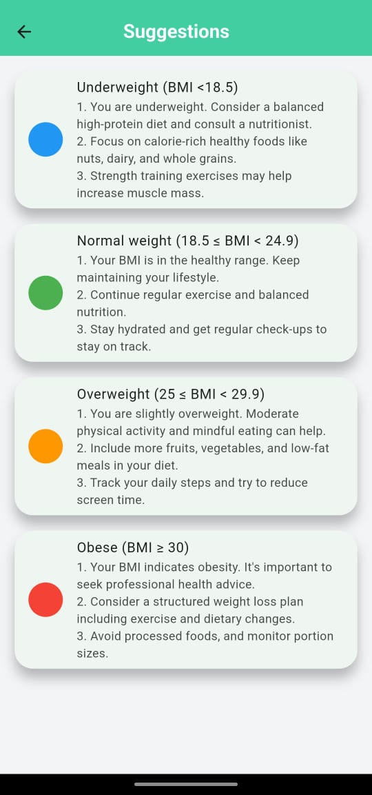

# BMI Calculator 💪

A simple and interactive **BMI (Body Mass Index)** Calculator app built using **Flutter**.  
Users can input their height in **feet + inches** and weight in **kg**, and the app calculates their BMI with a health category.

---

## 🚀 Features

- 🎯 Real-time BMI Calculation
- 📏 Height input in **feet + inches** (converted internally to **meters**)
- ⚖️ Weight input in **kilograms**
- ✅ Displays BMI and health category:
    - Underweight
    - Normal
    - Overweight
    - Obese
- 📱 Clean and responsive UI
- 🔁 Reset or recalculate with one tap

---

## 📸 Screenshots

### 🟦 Starting Screen


### 🧮 Calculator Screen


### 📊 Output Screen


### 💡 Suggestions Page


---

## 🛠️ Tech Stack

- **Flutter**
- **Dart**

---

## 🧑‍💻 Getting Started

To run this project locally:

```bash
git clone https://github.com/AnujSingh096/Projects.git
cd bmi_app
flutter pub get
flutter run

```


## ✨ Author

**Anuj Kumar**  
GitHub: [AnujSingh096](https://github.com/AnujSingh096)